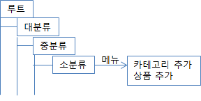
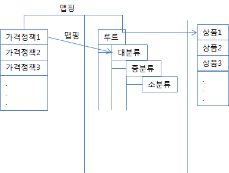

# 웹버전 상품매니저(wProductManager) 설계

## 목적
- ...

## 예상 일정
1. 데이터 모델 설계
2. API 설계
3. 프로토 타입 개발

## 웹버전 상품매니저 예상 기능
- 카테고리 입력
- 카테고리 수정
- 카테고리 삭제
- 카테고리 조회
- 상품 정보 입력
- 상품 정보 수정
- 상품 정보 삭제
- 상품 목록 조회
- 카테고리와 상품 맵핑
- 가격 정책 정보 입력
- 가격 정책 정보 수정
- 가격 정책 정보 삭제
- 가격 정책 목록 조회
- 가격 정책 정보 조회?
- 상품과 가격 정책 맵핑
- 상품 아이템 정보 조회
- 상품과 상품 아이템 맵핑

## 웹버전 상품매니저 예상 UI

### 카테고리

### 상품과 가격정책 맵핑

## 일반 상품(Common Product)

### Model

#### Category
- 상품의 분류를 위한 정보

<table>
  <tr><td>이름</td><td>타입</td><td>설명</td></tr>  
  <tr><td>id</td><td>int</td><td>카테고리의 id</td></tr>
  <tr><td>name</td><td>string</td><td>카테고리의 이름</td></tr>
  <tr><td>description</td><td>string</td><td>카테고리의 설명</td></tr>
  <tr><td>type</td><td>string</td><td>카테고리의 유형. 기존 C3 카테고리는 VODMenu 타입이라고 할 수 있음</td></tr>
  <tr><td>parentCategory</td><td>int</td><td>부모 카테고리의 id. 최상위 카테고리는 정보 없음</td></tr>
</table>

#### Product
- 상품의 일반 정보

<table>
  <tr><td>이름</td><td>타입</td><td>설명</td></tr>  
  <tr><td>id</td><td>int</td><td>상품의 id</td></tr>
  <tr><td>name</td><td>string</td><td>상품의 이름</td></tr>
  <tr><td>description</td><td>string</td><td>상품의 설명</td></tr>
  <tr><td>type</td><td>string</td><td>상품의 유형</td></tr>
  <tr><td>price</td><td>int</td><td>상품의 가격. 기본가격</td></tr>
  <tr><td>image</td><td>string?</td><td>상품의 이미지 - 이미지 경로 정보일까? - 사이즈 별로 정보가 필요할까?</td></tr>
  <tr><td>externalId</td><td>string</td><td>상품의 외부 연동용 id</tr>
  <tr><td>category</td><td>string</td><td>상품의 범주. 카테고리는 타입의 상위 개념. 흔히 이야기하는 대분류, 소분류. 일괄적용같은 기능이 있다면 기준이 될 수 있는 항목(물론 타입도 되겠지만)</td></tr>
</table>

#### Pricing Policy
- 가격 정책 정보. 직접 가격을 정하거나 할인률을 설정하기 위한 정보. 상품과는 별개 정보이고 관계는 n:m. SO 같은 개념이 들어간다면 맵핑 모델에서 처리

<table>
  <tr><td>이름</td><td>타입</td><td>설명</td></tr>
  <tr><td>id</td><td>int</td><td>id</td></tr>
  <tr><td>name</td><td>string</td><td>정책의 이름</td></tr>
  <tr><td>type</td><td>string</td><td>정책의 유형. 가격을 직접 변경하거나 할인률만 적용하거나</td></tr>
  <tr><td>value</td><td>int</td><td>정책의 값. 유형에 따라 의미하는 바가 다름</td></tr>
  <tr><td>licenseStart</td><td>date</td><td>정책 라이선스 시작일</td></tr>
  <tr><td>licenseEnd</td><td>date</td><td>정책 라이선스 종료일</td></tr>
</table>

#### ProductItem
- 상품의 대상?물건?개념은 C3.Good과 비슷한 것 같음

#### CategoryProductMapping

#### ProductProductPolicyMapping

#### ProductProductItemMapping

### API

#### GetCategoryInfo
- 단일 카테고리의 정보 요청. 매니저에서 필요?

#### GetCategoryList
- 상품 카테고리의 정보 요청

#### AddCategoryInfo
- 카테고리 정보 입력

#### UpdateCategoryInfo
- 카테고리 정보 수정

#### DeleteCategoryInfo
- 카테고리 정보 삭제

#### GetProductInfo
- 단일 상품의 정보 요청. 매니저에서 필요?

#### GetProductList
- 상품 목록의 정보 요청

#### AddProductInfo
- 상품 정보 입력

#### UpdateProductInfo
- 상품 정보 수정

#### DeleteProductInfo
- 상품 정보 삭제

#### AddCategoryProductMappingInfo
- 카테고리와 상품 맵핑 정보 입력

#### GetPricePolicyInfo
- 단일 가격 정책의 정보 요청. 매니저에서 필요?

#### GetPricePolicytList
- 가격 정책 목록의 정보 요청

#### AddPricePolicyInfo
- 가격 정책 정보 입력

#### UpdatePricePolicyInfo
- 가격 정책 정보 수정

#### DeletePricePolicyInfo
- 가격 정책 정보 삭제

#### AddProductPricePolicyMappingInfo
- 상품과 가격 정책 맵핑 정보 입력

#### GetProductItenInfo
- 단일 상품 아이템의 정보 조회. 매니저에서 필요?

#### GetProductItenList
- 상품 아이템 목록의 정보 조회

#### SearchProductItenInfo
- 특정 조건의 상품 정보 조회

#### AddProductProductItemMappingInfo
- 상품과 상품 아이템 맵핑 정보 입력

### 개발 명세

### 기타

